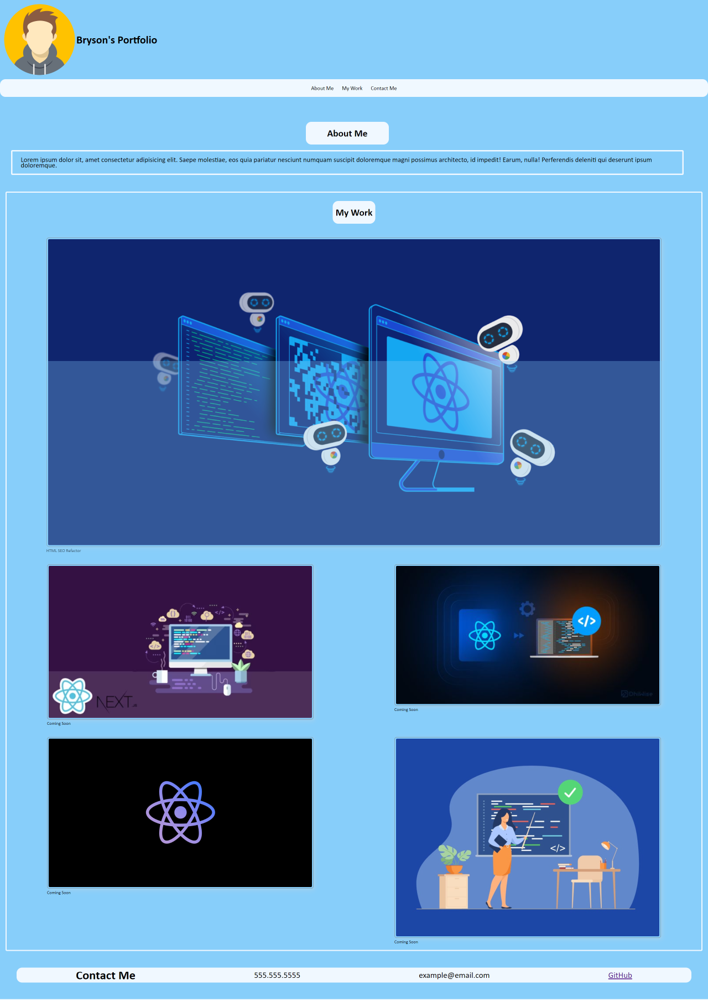
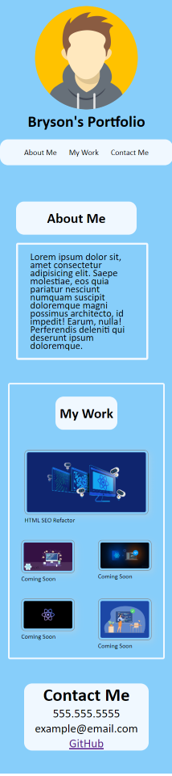

# Portfolio Challange

## What is the purpose?

The purpose of this challange was to create a mock portfolio that included a avatar, my name, and links to sections about me, my work, and my contact information.

    - The avatar and name were inserted using the img and h1 attributes in the header section of the HTML file.

    - The links were created by using a nav bar and using the href attribute to link the "about me", "my work", and "contact me" sections to the corrispponnding id's.

I also needed to list differnt projects that I have worked on.  The first project needed to be bigger in size and have needed to have a link that brought someone to the deployed application.
    - The images were placed in rows and columns using the flex box and flex wrap tags in the CSS file.

    - The main project size was increased by applying a greater width percentage to it's corresponding id.

    - The link was added by placing a href tag to the img attribute in the HTML file.

The portfolio also needed to be responsive to multiple screen ratios.

    - The website was made responsive to differnnt screen ratios by adding the @media tag in the CSS file.

 

## Links

[Live URL](https://bryson987081.github.io/portfolio-challange/)

[GitHub Repo](https://github.com/Bryson987081/portfolio-challange)